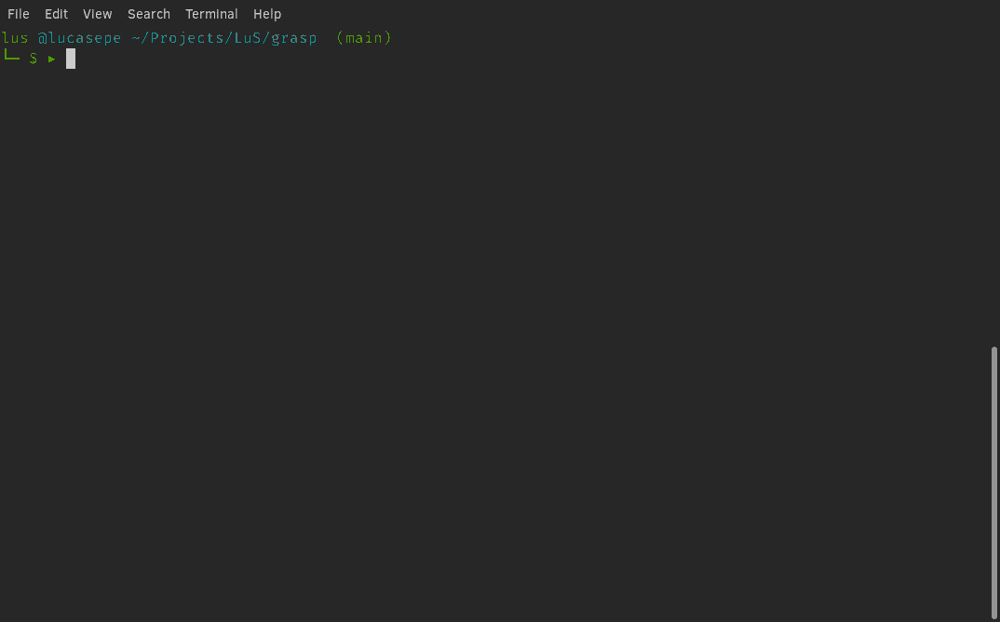

# `Grasp` 

[](https://goreportcard.com/report/github.com/lucasepe/grasp) &nbsp;&nbsp;&nbsp; [](https://gocover.io/_badge/github.com/lucasepe/grasp?nocache=grasp) &nbsp;&nbsp;&nbsp; [](https://twitter.com/intent/tweet?text=Wow:&url=https%3A%2F%2Fgithub.com%2Flucasepe%2Fgrasp) 

## Create strong passwords using words that are easy for you to remember

## A password manager that does not require any type of storage

Cross Platform simple and secure password generator / manager that does not require a file/cloud/whatever archive.

- [Open Source](https://github.com/lucasepe/grasp)
- Works on [Linux, Mac OS, Windows](https://github.com/lucasepe/grasp/releases/latest)
- Just a single portable binary file

Passwords become complicated (one capital letter, one number, one punctuation mark, one emoji, etc.)...

- It's impossible to use and remember different passwords for all of your accounts?
- You often reuse the same passwords on various accounts?
- Yes! There are a lot of greats passwords managers tools

Using `Grasp` all you need to remember are:

> your favorite words! anything that is easy for you to remember!
>
> (a poem? a song? a sequence of insults? :bowtie:)

---

## How to install

### [Go](https://golang.org/doc/install) get

```bash
$ go get -u github.com/lucasepe/grasp
```

## Ready-To-Use Releases 

[Here you can find `grasp` already compiled](https://github.com/lucasepe/grasp/releases/latest) for:

- MacOS 
- Linux 
- Windows

---

## How to use

```
$ ▶ grasp google pinco.pallo@gmail.com Vercingetorige! 
b:p8hIg[n6{]
```

Using these parameters `grasp` will generate a password:

 - unique
 - complex and safe
 - that meets all validation standards (uppercase, lowercase, numbers and special characters)

`Grasp` creates strong passwords using words that are easy for you to remember.

Using `Grasp` does not stop you from managing your passwords using a secure 'wallet' and in fact <u>this is encouraged</u>. 

<u>The combination of both tools will be winning.</u>

- for this purpose, let me introduce [PWSafe](https://www.lucasepe.it/downloads/pwsafe/) ... check it out!
 
What `Grasp` gives to you is:

  - a simple way to generate good quality and safe passwords for websites and other services
  - a secure mechanism to retrieve your passwords 
  - an easy system for managing your passwords

:warning: **WARNING!**

> **To recreate the same password for a given account you must make sure you don't forget the original words ​​you used**.
> 
> **If you enter different words, `Grasp` will produce a different password! (the order of the words and the difference between upper and lower case is also important)**
  
## How does `Grasp` works?

The sequence of words you type after the command is used as secret and salt (the last word) to generate a secret key using [Password-Based Key Derivation Function 2](https://en.wikipedia.org/wiki/PBKDF2) (PBKDF2).
 
 - The result of this encryption is used as seed for a deterministic random number generator (PRNG).
 
 - Then the password is composed picking random characters using the integers generated by this PRNG.

All these calculations are done "on the fly" every time you request it. This is why `Grasp` does not need any archive.


